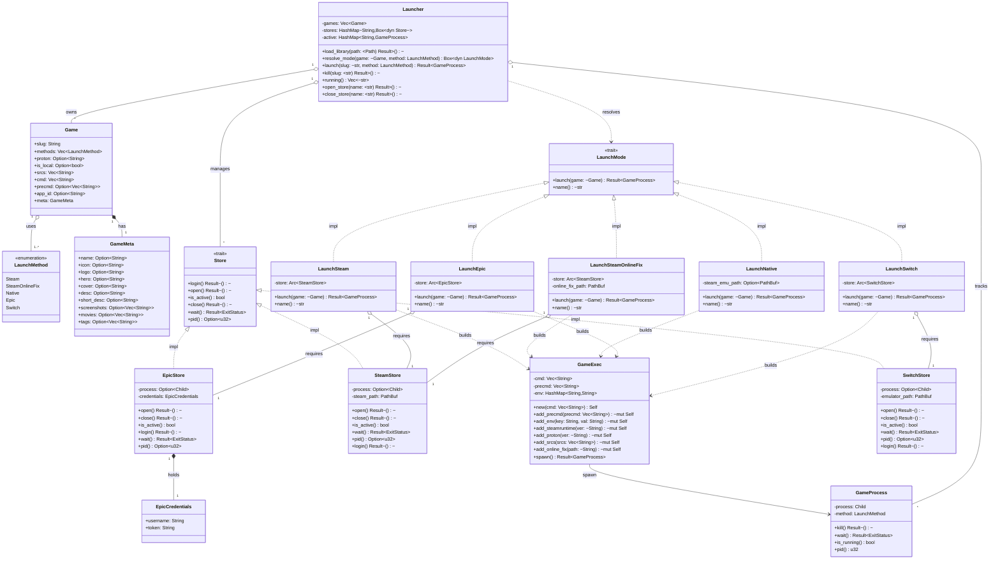

```mermaid
classDiagram
  direction TB

  class LaunchMethod {
    <<enumeration>>
    Steam
    SteamOnlineFix
    Native
    Epic
    Switch
  }

  class Game {
    +slug: String
    +methods: Vec~LaunchMethod~
    +proton: Option~String~
    +is_local: Option~bool~
    +srcs: Vec~String~
    +cmd: Vec~String~
    +precmd: Option~Vec~String~~
    +app_id: Option~String~
    +meta: GameMeta
  }

  class GameMeta {
    +name: Option~String~
    +icon: Option~String~
    +logo: Option~String~
    +hero: Option~String~
    +cover: Option~String~
    +desc: Option~String~
    +short_desc: Option~String~
    +screenshots: Option~Vec~String~~
    +movies: Option~Vec~String~~
    +tags: Option~Vec~String~~
  }

  class GameExec {
    -cmd: Vec~String~
    -precmd: Vec~String~
    -env: HashMap~String,String~
    +new(cmd: Vec~String~) Self
    +add_precmd(precmd: Vec~String~) ~mut Self
    +add_env(key: String, val: String) ~mut Self
    +add_steamruntime(ver: ~String) ~mut Self
    +add_proton(ver: ~String) ~mut Self
    +add_srcs(srcs: Vec~String~) ~mut Self
    +add_online_fix(path: ~String) ~mut Self
    +spawn() Result~GameProcess~
  }

  class GameProcess {
    -process: Child
    -method: LaunchMethod
    +kill() Result~()~
    +wait() Result~ExitStatus~
    +is_running() bool
    +pid() u32
  }

  class Store {
    <<trait>>
    +login() Result~()~
    +open() Result~()~
    +is_active() bool
    +close() Result~()~
    +wait() Result~ExitStatus~
    +pid() Option~u32~
  }

  class SteamStore {
    -process: Option~Child~
    -steam_path: PathBuf
    +open() Result~()~
    +close() Result~()~
    +is_active() bool
    +wait() Result~ExitStatus~
    +pid() Option~u32~
    +login() Result~()~
  }

  class EpicStore {
    -process: Option~Child~
    -credentials: EpicCredentials
    +open() Result~()~
    +close() Result~()~
    +is_active() bool
    +login() Result~()~
    +wait() Result~ExitStatus~
    +pid() Option~u32~
  }

  class SwitchStore {
    -process: Option~Child~
    -emulator_path: PathBuf
    +open() Result~()~
    +close() Result~()~
    +is_active() bool
    +wait() Result~ExitStatus~
    +pid() Option~u32~
    +login() Result~()~
  }

  class EpicCredentials {
    +username: String
    +token: String
  }

  class LaunchMode {
    <<trait>>
    +launch(game: ~Game) Result~GameProcess~
    +name() ~str
  }

  class LaunchSteam {
    -store: Arc~SteamStore~
    +launch(game: ~Game) Result~GameProcess~
    +name() ~str
  }

  class LaunchSteamOnlineFix {
    -store: Arc~SteamStore~
    -online_fix_path: PathBuf
    +launch(game: ~Game) Result~GameProcess~
    +name() ~str
  }

  class LaunchNative {
    -steam_emu_path: Option~PathBuf~
    +launch(game: ~Game) Result~GameProcess~
    +name() ~str
  }

  class LaunchEpic {
    -store: Arc~EpicStore~
    +launch(game: ~Game) Result~GameProcess~
    +name() ~str
  }

  class LaunchSwitch {
    -store: Arc~SwitchStore~
    +launch(game: ~Game) Result~GameProcess~
    +name() ~str
  }

  class Launcher {
    -games: Vec~Game~
    -stores: HashMap~String,Box~dyn Store~~
    -active: HashMap~String,GameProcess~
    +load_library(path: ~Path) Result~()~
    +resolve_mode(game: ~Game, method: LaunchMethod) Box~dyn LaunchMode~
    +launch(slug: ~str, method: LaunchMethod) Result~GameProcess~
    +kill(slug: ~str) Result~()~
    +running() Vec~~str~
    +open_store(name: ~str) Result~()~
    +close_store(name: ~str) Result~()~
  }

  Game "1" *-- "1" GameMeta : has
  Game "1" o-- "1..*" LaunchMethod : uses

  GameExec --> GameProcess : spawn

  Store <|.. SteamStore : impl
  Store <|.. EpicStore : impl
  Store <|.. SwitchStore : impl

  EpicStore "1" *-- "1" EpicCredentials : holds

  LaunchMode <|.. LaunchSteam : impl
  LaunchMode <|.. LaunchSteamOnlineFix : impl
  LaunchMode <|.. LaunchNative : impl
  LaunchMode <|.. LaunchEpic : impl
  LaunchMode <|.. LaunchSwitch : impl

  LaunchSteam "1" o-- "1" SteamStore : requires
  LaunchSteamOnlineFix "1" o-- "1" SteamStore : requires
  LaunchEpic "1" o-- "1" EpicStore : requires
  LaunchSwitch "1" o-- "1" SwitchStore : requires

  LaunchSteam ..> GameExec : builds
  LaunchSteamOnlineFix ..> GameExec : builds
  LaunchNative ..> GameExec : builds
  LaunchEpic ..> GameExec : builds
  LaunchSwitch ..> GameExec : builds

  Launcher "1" o-- "*" Store : manages
  Launcher "1" o-- "*" Game : owns
  Launcher "1" o-- "*" GameProcess : tracks
  Launcher ..> LaunchMode : resolves
```
